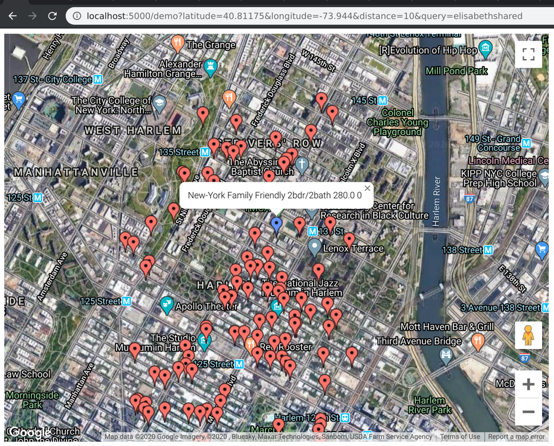

# Simple Room Search API

Basic room listing search API supports finding listings given search diameter and a text query. Sample data are from about 50,000 listings in NYC.

Demo page:


## Setup

Run locally in a standard Python 3 virtual enviroment:

1. Create environment
```
$ virtualenv -p /usr/bin/python3 venv
$ pip install -r requirements.txt
```

2. Create database (sqlite3)
```
$ flask db upgrade
```

3. Run server and upload some data
```
$ python server.py
```

Navigate to http://localhost:5000/uploadData and upload CSV file contains listing data
(this step takes about 5 seconds, depends on the amount of data). Some expected `Cannot import listing ...` log error(s) are printed. Expected HTTP response:
```
{
"message": "Added ... records, failed with ... other records(s)",
"status": "ok"
}
```

## Usages

- API endpoint: `/searchRoom`
- Demo page: `/demo`

They accept the same inputs. Input keys are `latitude`, `longitude`, `distance` (km), and a freeform `query`. For example:

- http://localhost:5000/searchRoom?latitude=40.81175&longitude=-73.944&distance=10&query=elisabethshared

- http://localhost:5000/demo?latitude=40.81175&longitude=-73.944&distance=10&query=elisabethshared

Sample API response:
```
{
"status": "ok"
"results": [
    {
    "availability_365": 157,
    "calculated_host_listings_count": 1,
    "distance": 0.48041137823082897,
    "host_id": 2240143,
    "host_name": "Pavel",
    "id": 2850,
    "imported_id": 1617443,
    "last_review": "Mon, 27 May 2019 00:00:00 GMT",
    "latitude": 40.81606,
    "longitude": -73.94363,
    "match_score": 2,
    "minimum_nights": 3,
    "name": "Great Artistic Studio in Historic Building",
    "neighbourhood": "Harlem",
    "neighbourhood_group": "Manhattan",
    "number_of_reviews": 38,
    "price": 85,
    "reviews_per_month": 0.56,
    "room_type": "shared"
    },
    {
    "availability_365": 0,
    "calculated_host_listings_count": 2,
    "distance": 0.24413343951512395,
    "host_id": 9051298,
    "host_name": "Lydiah",
    "id": 4119,
    "imported_id": 2657689,
    "last_review": null,
    "latitude": 40.8106,
    "longitude": -73.94647,
    "match_score": 2,
    "minimum_nights": 1,
    "name": "Your Amazing Vacation Apartment!",
    "neighbourhood": "Harlem",
    "neighbourhood_group": "Manhattan",
    "number_of_reviews": 0,
    "price": 100,
    "reviews_per_month": null,
    "room_type": "shared"
    },
...
```

## Notes

If the query include some sort of indicator of a room type (such as containing word "private"),
the match-scoring function favors listing with that room type. Including neighborhood name, etc.
may also yield more relevant results.

### Notes on given input

There are 49081 lines in the CSV file. From those, the program as of now can parse and import 48894 listings (about 200+ listings span on 2 or more lines detected and handled).

## Libraries and frameworks

- Flask, SQLAlchemy
- Alembic for database migration

(see requirements.txt)
